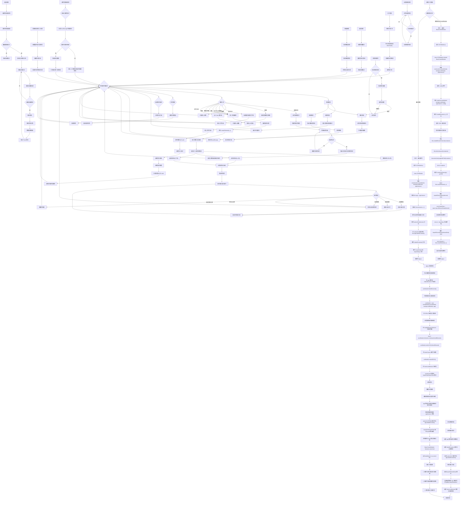

## 工具開發詳細程式設計流程說明

### 方式一：繼承 BaseControlModule（推薦）
適用於需要標準 3 按鈕控制的工具（移動、刪除、縮放）

#### 1. 建立模組檔案
```javascript
class XXXModule extends BaseControlModule {
    constructor(canvasModule, backgroundModule, appInstance) {
        const config = {
            defaultWidth: 200,
            defaultHeight: 150,
            toolName: '工具名稱'
        };
        super(canvasModule, backgroundModule, appInstance, config);
    }
}
```

#### 2. 核心方法實作
- `createElement(x, y)`: 建立元素 DOM
- `exportElementData(element)`: 匯出元素資料
- `importElementData(elementData)`: 匯入元素資料

### 方式二：獨立實作
適用於需要特殊控制邏輯的工具（如 QRCodeModule）

#### 關鍵要求：
1. 建構函數必須接收 `appInstance`
2. `selectXXX` 方法開始要呼叫 `this.app.hideAllControls()`
3. 實作 `hideAllControls()` 方法
4. 座標使用 `style.left/top` 而非 `getBoundingClientRect()`

### app.js 整合步驟
1. 全域變數宣告
2. hideAllControls 方法新增
3. 模組初始化（確保在 app 物件建立後）
4. HTML 按鈕和事件監聽器
5. handleElementSelection 新增判斷
6. clearCanvas 整合
7. SaveLoadModule 整合
``` 